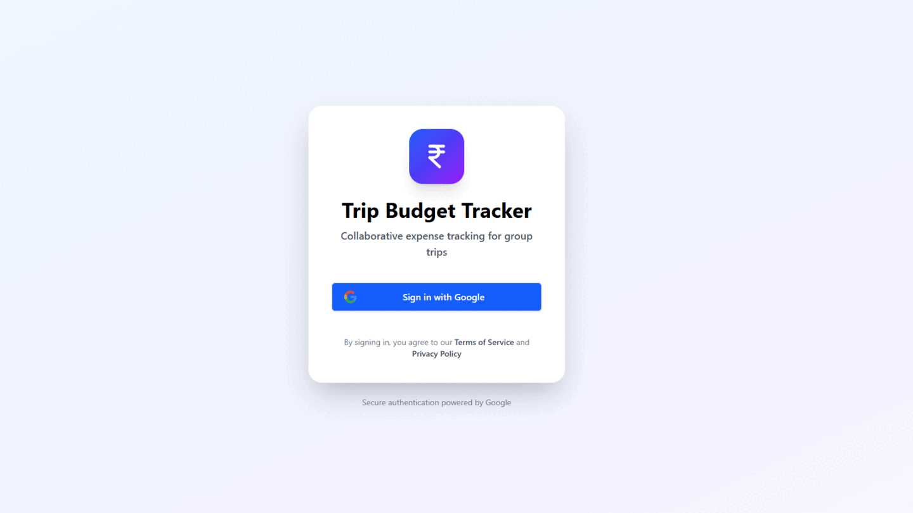

# 🌟 TripBudget - Collaborative Trip Expense Tracker

> A modern, real-time expense tracking application for group trips built with React, Firebase, and Tailwind CSS. Track expenses, manage budgets, and collaborate seamlessly with your travel companions!



[](https://react.dev/)
[](https://firebase.google.com/)
[](https://tailwindcss.com/)
[](LICENSE)

---

## ✨ Features

### 🔐 **Secure Authentication**
- 🔑 **Google OAuth Sign-In** - One-click authentication with Google accounts
- 👤 **Automatic Profile Creation** - User profiles generated from Google account info
- 🛡️ **Firebase Security** - Enterprise-grade security with Firestore rules

### 👥 **Multi-Group Collaboration**
- ➕ **Create Trip Groups** - Set trip names and budgets in Indian Rupees (₹)
- 🎟️ **Invite Code System** - Share unique 6-digit codes to invite members
- 📊 **Personal Dashboard** - View and manage all your trip groups
- 🗑️ **Group Management** - Admins can manage settings and members

### 💰 **Smart Expense Tracking**
- ✏️ **Add & Edit Expenses** - Track amount, description, category, and date
- 🏷️ **Custom Categories** - Create group-specific expense categories beyond defaults
- 🔄 **Real-Time Sync** - Live updates across all group members' devices
- 👁️ **Expense Details** - View complete expense information with timestamps
- 🗑️ **Expense Management** - Edit or delete your own expenses

### 🔍 **Powerful Filtering**
- 🔎 **Smart Search** - Filter by description, category, or member name
- 📅 **Date Range Filters** - View expenses within specific time periods
- 💵 **Amount Filters** - Filter by expense ranges
- 👥 **Member Filters** - See individual member contributions
- 🏷️ **Category Filters** - Group expenses by spending categories

### 📊 **Analytics & Insights**
- 📈 **Budget Progress Tracking** - Visual progress bars showing budget utilization
- 🎯 **Category Breakdown** - Detailed spending analysis by category
- 👤 **Member Statistics** - Individual contribution tracking
- 💰 **Budget Alerts** - Real-time budget vs. spending comparison

### 📄 **Trip Reports**
- 📥 **HTML Export** - Generate professional trip reports
- 📊 **Comprehensive Data** - Complete expense lists, statistics, and summaries
- 📧 **Shareable Reports** - Easy sharing with trip participants

### 🎨 **Modern User Experience**
- 📱 **Fully Responsive** - Optimized for mobile, tablet, and desktop
- 🎭 **Tailwind CSS Styling** - Clean, modern, and accessible UI
- 🔔 **Toast Notifications** - Non-intrusive success and error messages
- ⚡ **Fast Performance** - Vite-powered build for instant hot reloading
- 🇮🇳 **Indian Localization** - Rupee (₹) currency throughout

---

## 🛠️ Tech Stack

### **Frontend**
- ⚛️ **React 19.1.0** - Latest React with concurrent features
- ⚡ **Vite 6.3.5** - Lightning-fast build tool and dev server
- 🎨 **Tailwind CSS 4.1.10** - Utility-first CSS framework
- 🎯 **Lucide React** - Beautiful, consistent icon library
- 🍞 **React Hot Toast** - Elegant toast notifications

### **Backend & Services**
- 🔥 **Firebase 12.5.0** - Backend-as-a-Service platform
  - **Firestore** - NoSQL real-time database
  - **Authentication** - Google OAuth integration
  - **Security Rules** - Fine-grained access control
- 📊 **Firestore Indexes** - Optimized query performance

### **Development Tools**
- 📦 **pnpm** - Fast, disk-efficient package manager
- 🔍 **ESLint** - Code quality and consistency
- 🔧 **Firebase CLI** - Deployment and management tools
- 📈 **Vercel Analytics** - Performance monitoring

---

## 🚀 Quick Start

### **Prerequisites**

Before you begin, ensure you have:

- ✅ **Node.js 18+** installed ([Download](https://nodejs.org/))
- ✅ **pnpm** package manager (`npm install -g pnpm`)
- ✅ **Google Account** for OAuth authentication
- ✅ **Firebase Account** (free tier works perfectly!)

### **Installation & Setup**

#### **1️⃣ Clone the Repository**

```bash
git clone https://github.com/ARPANPATRA111/TripBudget.git
cd TripBudget
```

#### **2️⃣ Install Dependencies**

```bash
pnpm install
```

#### **3️⃣ Create Firebase Project**

1. Go to [Firebase Console](https://console.firebase.google.com/)
2. Click **"Add Project"** and follow the wizard
3. Enable **Google Authentication**:
   - Navigate to **Authentication** → **Sign-in method**
   - Enable **Google** provider
4. Create **Firestore Database**:
   - Navigate to **Firestore Database**
   - Click **"Create Database"**
   - Choose **Production mode** (we'll add rules later)
   - Select your preferred region

#### **4️⃣ Configure Environment Variables**

1. In Firebase Console, go to **Project Settings** → **General**
2. Under **"Your apps"**, click the web icon (`</>`)
3. Register your app and copy the config values
4. Create `.env` file in project root:

```bash
# Windows
copy .env.example .env

# macOS/Linux
cp .env.example .env
```

5. Add your Firebase credentials to `.env`:

```env
VITE_FIREBASE_API_KEY=AIzaSyXXXXXXXXXXXXXXXXXXXXXXXXXXXXXX
VITE_FIREBASE_AUTH_DOMAIN=your-project.firebaseapp.com
VITE_FIREBASE_PROJECT_ID=your-project-id
VITE_FIREBASE_STORAGE_BUCKET=your-project.appspot.com
VITE_FIREBASE_MESSAGING_SENDER_ID=123456789012
VITE_FIREBASE_APP_ID=1:123456789012:web:abcdef123456
```

#### **5️⃣ Deploy Firestore Configuration**

```bash
# Login to Firebase
firebase login

# Initialize Firestore (select your project)
firebase init firestore

# Deploy security rules and indexes
firebase deploy --only firestore:rules,firestore:indexes
```

#### **6️⃣ Start Development Server**

```bash
pnpm run dev
```

🎉 Open [http://localhost:5173](http://localhost:5173) in your browser!

---

## 📖 How to Use

### **🔐 Sign In**

1. Click **"Sign in with Google"** on the login page
2. Select your Google account
3. Grant permissions
4. Your profile is automatically created!

### **👥 Create a Trip Group**

1. On your dashboard, click **"Create Group"**
2. Enter trip details:
   - **Trip Name** (e.g., "Goa Beach Trip 2025")
   - **Total Budget** in Rupees (e.g., ₹50,000)
3. You'll receive a unique **6-digit invite code**
4. Share the code with your trip companions!

### **🤝 Join an Existing Group**

1. Click **"Join Group"** on your dashboard
2. Enter the 8-digit invite code
3. You're instantly added as a member!

### **💸 Add an Expense**

1. Select a group from your dashboard
2. Click the **"Add Expense"** button
3. Fill in the expense details:
   - **Amount** (in Rupees)
   - **Description** (e.g., "Dinner at Beach Shack")
   - **Category** (choose from dropdown or add custom)
   - **Date** of the expense
4. Click **"Add Expense"**
5. The expense appears instantly for all group members!

### **🏷️ Create Custom Categories**

1. When adding an expense, select **"+ Add Custom Category"**
2. Enter your category name (e.g., "Souvenirs", "Tips")
3. Click the **Plus (+)** button to confirm
4. The category is now available for everyone in the group!

### **🔍 Filter & Search Expenses**

- **Search Bar**: Find expenses by description, category, or member name
- **Category Filter**: View expenses from specific categories
- **Member Filter**: See individual member contributions
- **Date Range**: Filter expenses by time period
- **Amount Range**: Find expenses within specific price ranges

### **📊 View Statistics**

- **Budget Progress**: Visual bars showing spent vs. remaining budget
- **Category Breakdown**: Pie chart of spending by category
- **Member Stats**: Individual contribution summaries
- **Real-Time Updates**: Statistics update instantly as expenses are added

### **📄 Export Trip Report**

1. Open any group
2. Click **"Generate Trip Log"** or delete the group
3. Download a beautiful HTML report containing:
   - Complete expense list with timestamps
   - Category-wise breakdown
   - Member contribution summary
   - Budget vs. actual spending analysis

### **✏️ Edit or Delete Expenses**

- Click on any of **your own expenses** to view details
- Use **Edit** button to modify amount, description, category, or date
- Use **Delete** button to remove the expense
- Changes sync instantly across all devices

### **🗑️ Manage Your Group**

**As Group Admin (Creator):**

- View all members and their profiles
- Delete the group (automatically generates trip log first)
- Monitor all group expenses and statistics

**As Group Member:**

- Add, edit, and delete your own expenses
- View all group expenses and statistics
- Access group budget and spending insights

---

## 📂 Project Structure

```plaintext
TripBudget/
├── src/
│   ├── components/
│   │   ├── auth/
│   │   │   └── Login.jsx              # Google OAuth login component
│   │   ├── budget/
│   │   │   ├── BudgetCards.jsx        # Budget display cards
│   │   │   ├── BudgetProgress.jsx     # Budget progress visualization
│   │   │   └── SetBudgetForm.jsx      # Budget configuration form
│   │   ├── common/
│   │   │   ├── Avatar.jsx             # User avatar component
│   │   │   ├── Button.jsx             # Reusable button component
│   │   │   ├── Dialog.jsx             # Modal dialog component
│   │   │   └── Loading.jsx            # Loading spinner
│   │   ├── expenses/
│   │   │   ├── ExpenseDialog.jsx      # Add/edit expense modal
│   │   │   ├── ExpenseDetailDialog.jsx # View expense details
│   │   │   ├── ExpenseItem.jsx        # Individual expense card
│   │   │   ├── ExpenseList.jsx        # Expense list container
│   │   │   ├── FiltersSection.jsx     # Filtering controls
│   │   │   └── GroupExpensesView.jsx  # Main expenses view
│   │   ├── groups/
│   │   │   └── GroupCard.jsx          # Group display card
│   │   ├── layout/
│   │   │   └── Header.jsx             # App header with navigation
│   │   └── stats/
│   │       ├── CategoryStats.jsx      # Category breakdown stats
│   │       └── UserStats.jsx          # Member statistics
│   ├── utils/
│   │   ├── auth.js                    # Firebase auth utilities
│   │   ├── helpers.js                 # Helper functions
│   │   ├── supabase.js                # Database operations
│   │   └── tripLog.js                 # Trip report generation
│   ├── App.jsx                        # Main app component
│   ├── main.jsx                       # App entry point
│   ├── App.css                        # Global styles
│   └── index.css                      # Tailwind imports
├── public/                            # Static assets
├── firestore.rules                    # Firestore security rules
├── firestore.indexes.json             # Database indexes
├── firebase.json                      # Firebase configuration
├── .env                               # Environment variables
├── vite.config.js                     # Vite configuration
├── package.json                       # Dependencies
└── README.md                          # This file
```

---

## 🚢 Deployment

### **Deploy to Vercel (Recommended)**

1. **Install Vercel CLI:**

   ```bash
   npm install -g vercel
   ```

2. **Build the project:**

   ```bash
   pnpm run build
   ```

3. **Deploy:**

   ```bash
   vercel
   ```

4. **Configure Environment Variables:**
   - Go to your Vercel project dashboard
   - Navigate to **Settings** → **Environment Variables**
   - Add all `VITE_FIREBASE_*` variables from your `.env` file

5. **Update Firebase Authorized Domains:**
   - Go to Firebase Console → **Authentication** → **Settings**
   - Add your Vercel domain (e.g., `your-app.vercel.app`) to authorized domains

### **Deploy to Netlify**

1. **Build the project:**

   ```bash
   pnpm run build
   ```

2. **Deploy using Netlify CLI:**

   ```bash
   npm install -g netlify-cli
   netlify deploy --prod
   ```

3. **Configure Environment Variables** in Netlify dashboard

### **Manual Build**

```bash
# Build for production
pnpm run build

# Preview production build locally
pnpm run preview
```

---

## 🤝 Contributing

We welcome contributions! Here's how you can help:

### **Getting Started**

1. **Fork the repository**
2. **Clone your fork:**

   ```bash
   git clone https://github.com/YOUR_USERNAME/TripBudget.git
   ```

3. **Create a feature branch:**

   ```bash
   git checkout -b feature/amazing-feature
   ```

4. **Make your changes and commit:**

   ```bash
   git commit -m 'Add: amazing new feature'
   ```

5. **Push to your fork:**

   ```bash
   git push origin feature/amazing-feature
   ```

6. **Open a Pull Request**

### **Contribution Guidelines**

- ✅ Follow existing code style and conventions
- ✅ Write meaningful commit messages
- ✅ Test your changes thoroughly
- ✅ Update documentation if needed
- ✅ Keep PRs focused on a single feature/fix

---

## 🐛 Known Issues & Roadmap

### **Coming Soon**

- [ ] Leave group functionality for members
- [ ] Expense splitting algorithms (equal, custom, percentage)
- [ ] Currency conversion support
- [ ] Dark mode theme
- [ ] Email notifications for new expenses
- [ ] Mobile app (React Native)
- [ ] Recurring expenses support
- [ ] Receipt image upload

### **Reporting Issues**

Found a bug? [Open an issue](https://github.com/ARPANPATRA111/TripBudget/issues) with:

- Clear description of the problem
- Steps to reproduce
- Expected vs. actual behavior
- Screenshots (if applicable)

---

## 📜 License

This project is licensed under the **MIT License** - see the [LICENSE](LICENSE) file for details.

---

## 👨‍💻 Author

**Arpan Patra**

- 🐙 GitHub: [ARPANPATRA111](https://github.com/ARPANPATRA111)
- 📧 Email: [Thispc119@gmail.com](mailto:thispc119@gmail.com)
- 🌐 Portfolio: [arpan111.vercel.app](https://arpan111.vercel.app)

---

## 🙏 Acknowledgments

- [React](https://react.dev/) - UI library
- [Firebase](https://firebase.google.com/) - Backend platform
- [Tailwind CSS](https://tailwindcss.com/) - CSS framework
- [Vite](https://vitejs.dev/) - Build tool
- [Lucide Icons](https://lucide.dev/) - Icon library
- [React Hot Toast](https://react-hot-toast.com/) - Toast notifications

---

## ⭐ Show Your Support

If you find this project helpful, please consider giving it a ⭐ on GitHub!

---

<div align="center">

**Built with ❤️ by [Arpan Patra](https://github.com/ARPANPATRA111)**

[Report Bug](https://github.com/ARPANPATRA111/TripBudget/issues) • [Request Feature](https://github.com/ARPANPATRA111/TripBudget/issues) • [Documentation](https://github.com/ARPANPATRA111/TripBudget/wiki)

</div>
